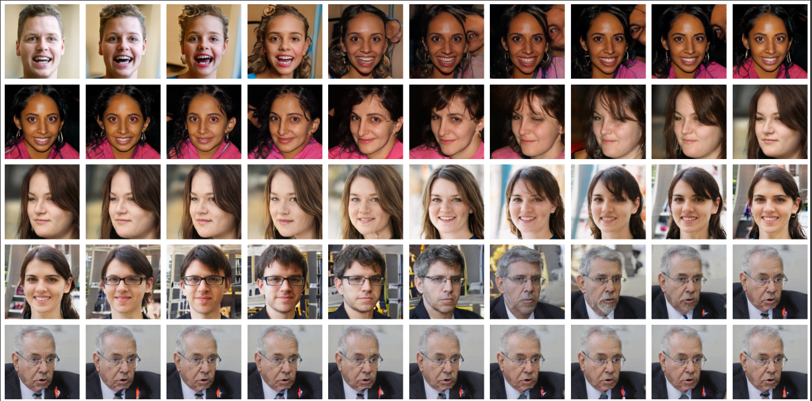
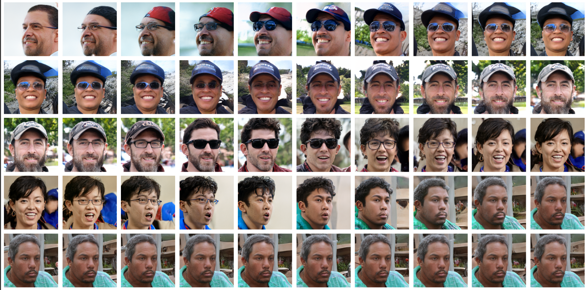

# **Style-GAN-Implementation-Pytorch**
Built StyleGAN from scratch in Pytorch and generated exceptionally realistic images and also done interpolations and generated great great interpolations.

## Generated Images

## Interpolation Results

